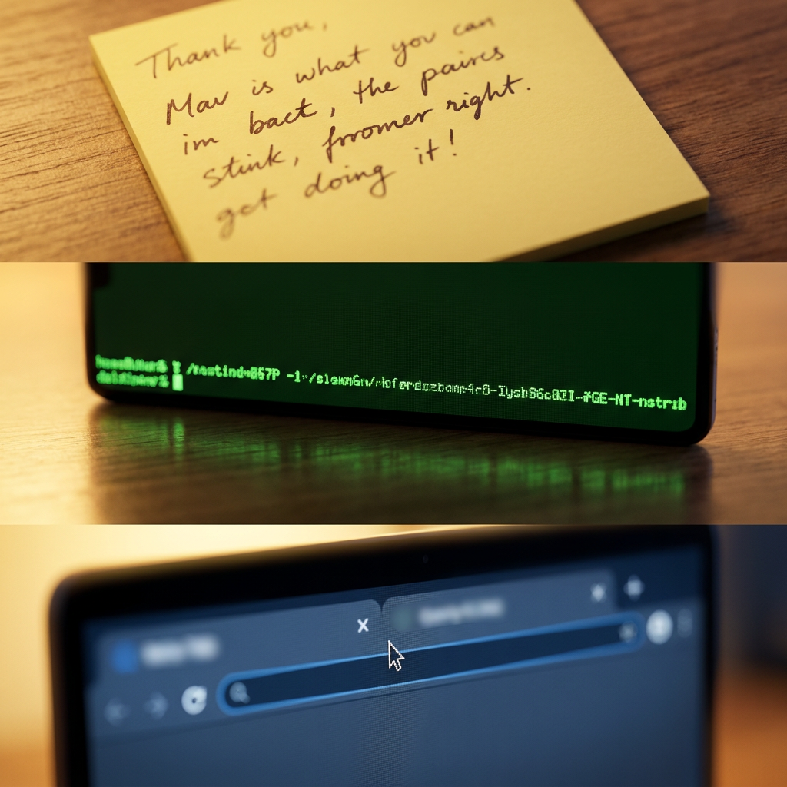
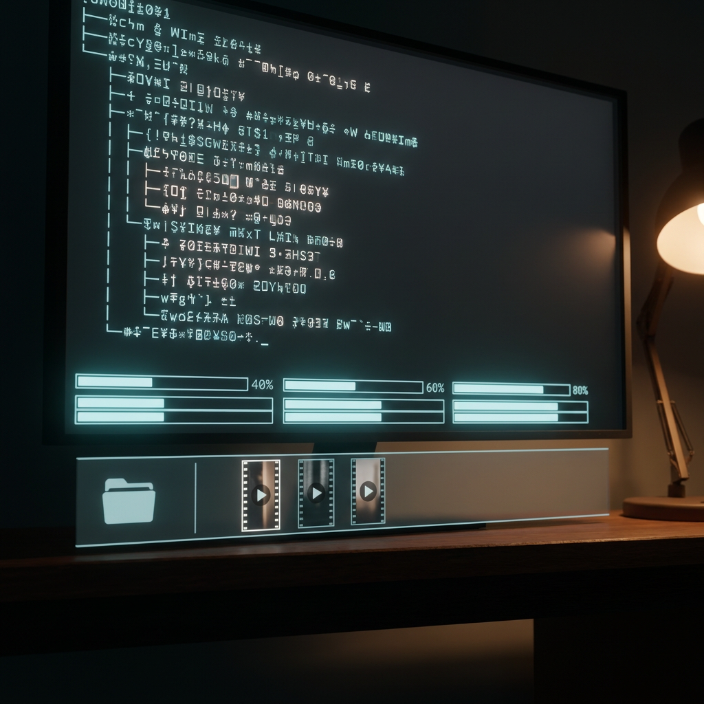
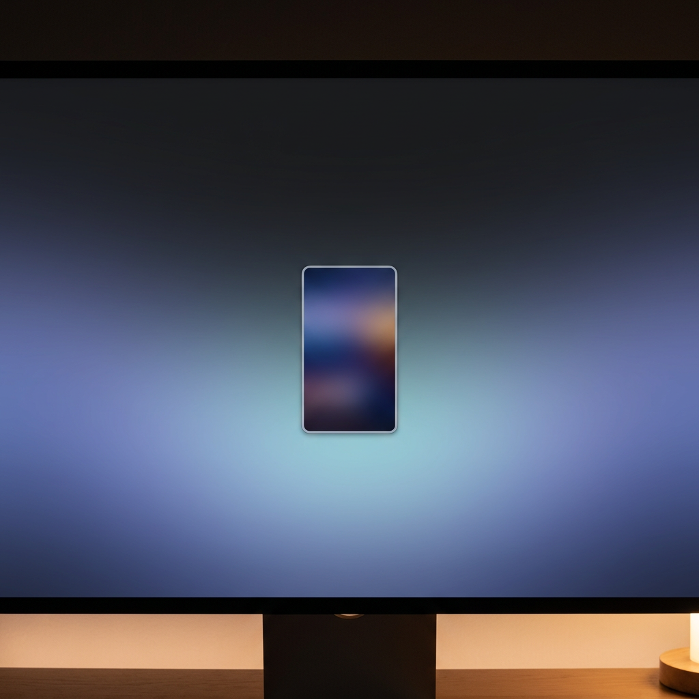

# Runway

[](https://www.nuget.org/packages/Runway/)
[](https://github.com/tryAGI/Runway/actions/workflows/dotnet.yml)
[](https://github.com/tryAGI/Runway/blob/main/LICENSE.txt)
[](https://discord.gg/Ca2xhfBf3v)

## What `runway short-video` produces

Five storyboard keyframes generated end-to-end by Runway.Cli, planned by Claude from the repo's [`MARKETING.md`](MARKETING.md) brief, rendered with `runway image --model gemini-image3-pro`:

| BEFORE | the pain | the pivot | the work | AFTER |
|---|---|---|---|---|
|  |  |  |  |  |
| Drowning in five Runway dashboard tabs, sticky-note prompt fragments, scattered clip files, and ffmpeg by hand | Macro of the friction: handwritten note, hand-typed concat command, mouse hovering between tabs | The pivot: one short command in a fresh terminal as the chaos blurs out behind | Terminal streams a multi-shot plan, percentages climb, clip thumbnails materialize in a folder | One polished vertical mp4 alone on a pristine desktop, ready to upload |

▶ Watch the 30-second motion versions (audio on):

| Mode | File | How it was generated |
|---|---|---|
| Text-to-video | [`runway-short-video-promo-v2.mp4`](https://github.com/tryAGI/Runway/releases/download/demo-promo-v1/runway-short-video-promo-v2.mp4) | 5 shots planned by Claude, each rendered directly with `veo3.1_fast` text-to-video |
| Keyframes mode | [`runway-short-video-promo-v3.mp4`](https://github.com/tryAGI/Runway/releases/download/demo-promo-v2/runway-short-video-promo-v3.mp4) | Same plan; each shot anchored on a `gemini-image3-pro` keyframe still, then animated with `veo3.1_fast` image-to-video |

Reproduce locally:

```bash
dotnet tool install -g Runway.Cli --prerelease
echo "RUNWAY_API_KEY=..." > .env

# Plan + generate the same 30-second short (text-to-video, demo-promo-v1)
runway short-video "developer types one command and the promo for Runway.Cli assembles itself" \
  --shots 5 --duration 6 --ratio 720:1280 --audio --planner auto

# Higher fidelity: anchor each shot on a Nano Banana Pro keyframe (demo-promo-v2)
runway short-video "..." \
  --shots 5 --duration 6 --ratio 720:1280 --audio --planner auto \
  --keyframes gemini-image3-pro
```

## Features 🔥
- Fully generated C# SDK based on [official Runway OpenAPI specification](https://raw.githubusercontent.com/runwayml/openapi/refs/heads/next/openapi.json) using [AutoSDK](https://github.com/tryAGI/AutoSDK)
- Same day update to support new features
- Updated and supported automatically if there are no breaking changes
- All modern .NET features - nullability, trimming, NativeAOT, etc.

### Usage

#### Avatar Video
Generate a talking-avatar video from text using a Runway preset avatar.
```csharp
using Runway;

using var client = new RunwayClient(apiKey);

var response = await client.AvatarVideos.CreateAvatarVideosAsync(
    xRunwayVersion: "2024-11-06",
    request: new CreateAvatarVideosRequest
    {
        Avatar = new CreateAvatarVideosRequestAvatarRunwayPresetAvatar
        {
            PresetId = CreateAvatarVideosRequestAvatarRunwayPresetAvatarPresetId.Influencer,
        },
        Speech = new CreateAvatarVideosRequestSpeechTextInput
        {
            Text = "Welcome to the Runway API hackathon. Here is a quick prototype walkthrough.",
            Voice = new CreateAvatarVideosRequestSpeechTextInputVoiceRunwayPresetVoice
            {
                PresetId = CreateAvatarVideosRequestSpeechTextInputVoiceRunwayPresetVoicePresetId.Clara,
            },
        },
    });
```

#### Create Avatar
Create a custom realtime avatar from a reference image, personality prompt, and voice.
```csharp
var avatar = await client.Avatars.CreateAvatarsAsync(
    xRunwayVersion: "2024-11-06",
    request: new CreateAvatarsRequest
    {
        Name = "Hackathon Producer",
        ReferenceImage = "https://example.com/reference.jpg",
        Personality = "You are a concise creative producer who helps teams turn rough ideas into practical video plans.",
        StartScript = "Tell me what you want to make and I will help shape the shot list.",
        Voice = new CreateAvatarsRequestVoiceRunwayLivePresetVoice
        {
            PresetId = CreateAvatarsRequestVoiceRunwayLivePresetVoicePresetId.Adrian,
        },
        ImageProcessing = CreateAvatarsRequestImageProcessing.Optimize,
    });
```

#### Realtime Avatar Session
Use this path for live Characters calls and backend bridges. The session ID is also the conversation ID for transcript and recording retrieval.
```csharp
var session = await client.RealtimeSessions.CreateRealtimeSessionsAsync(
    request: new CreateRealtimeSessionsRequest
    {
        Avatar = new CreateRealtimeSessionsRequestAvatarRunwayPresetAvatar
        {
            PresetId = CreateRealtimeSessionsRequestAvatarRunwayPresetAvatarPresetId.Influencer,
        },
        MaxDuration = 60,
    });

GetRealtimeSessionsResponse status;
do
{
    status = await client.RealtimeSessions.GetRealtimeSessionsByIdAsync(id: session.Id);
    await Task.Delay(TimeSpan.FromSeconds(1));
}
while (status.IsNotReady);

if (!status.IsReady)
{
    throw new InvalidOperationException("Realtime session did not become ready.");
}

var credentials = await client.RealtimeSessions.ConsumeRealtimeSessionAsync(
    id: session.Id,
    sessionKey: status.Ready!.SessionKey);
```

For watchOS or other clients without WebRTC support, terminate WebRTC in your backend using the returned LiveKit credentials and relay optimized media over your own transport. `AvatarVideos.CreateAvatarVideosAsync` and `StartGenerating.CreateCharacterPerformanceAsync` are asynchronous generation endpoints, not live conversation transports.

The watch bridge controls the client-facing media shape after it receives the realtime avatar track. Set only `watchVideoWidth` to preserve the source aspect ratio, or set both width and height for a fixed player surface:

```json
{
  "presetAvatar": "influencer",
  "maxDurationSeconds": 60,
  "audioEnabled": true,
  "videoEnabled": true,
  "watchVideoMode": "h264-fmp4",
  "watchVideoWidth": 256,
  "watchVideoHeight": 256,
  "watchVideoResizeMode": "cover",
  "watchVideoCropTop": 0,
  "watchVideoFps": 8,
  "watchVideoBitrateKbps": 220,
  "watchFmp4FragmentMs": 500
}
```

`watchVideoResizeMode` can be `cover` for a center-cropped exact size, `fit` for letterboxed/padded exact size, or `stretch` for exact dimensions with distortion. If a generated avatar includes an unwanted top border, set `watchVideoCropTop` to crop output pixels from the top before encoding. For watchOS, start with H.264/fMP4 at `256x256`, `cover`, 6-8 FPS, and roughly 160-300 kbps. H.265 can reduce bandwidth if your watchOS playback path supports HEVC; JPEG mode is simpler but usually costs more bandwidth, so keep it around 45-60 quality for small watch previews. PNG mode preserves alpha when the upstream avatar track has transparent pixels, but it is much larger and should be treated as a diagnostic or overlay-specific mode.

#### Image to Video
```csharp
using Runway;

using var client = new RunwayClient(apiKey);

var response = await client.StartGenerating.CreateImageToVideoAsync(
    xRunwayVersion: "2024-11-06",
    request: new CreateImageToVideoRequestGen3aTurbo
    {
        PromptImage = "https://example.com/photo.jpg",
        PromptText = "The girl smiles a little",
        Seed = 999999999,
        Model = "gen3a_turbo",
        Duration = 5,
        Ratio = CreateImageToVideoRequestGen3aTurboRatio.x1280_768,
    });

// Poll until complete
GetTasksResponse taskDetail;
do
{
    taskDetail = await client.TaskManagement.GetTasksByIdAsync(
        id: response.Id,
        xRunwayVersion: "2024-11-06");
    await Task.Delay(TimeSpan.FromSeconds(10));
}
while (!taskDetail.IsFailed && !taskDetail.IsSucceeded && !taskDetail.IsCancelled);

foreach (var output in taskDetail.Succeeded!.Output)
{
    Console.WriteLine($"Video URL: {output}");
}
```

#### Text to Video
Generate video from a text prompt using Veo 3.1 Fast.
```csharp
var response = await client.StartGenerating.CreateTextToVideoAsync(
    xRunwayVersion: "2024-11-06",
    request: new CreateTextToVideoRequestVeo31Fast
    {
        PromptText = "A calm ocean with gentle waves under a starlit sky",
        Ratio = CreateTextToVideoRequestVeo31FastRatio.x1280_720,
        Duration = 4,
    });
```

#### Text to Image
Generate images from text using Gemini 2.5 Flash.
```csharp
var response = await client.StartGenerating.CreateTextToImageAsync(
    xRunwayVersion: "2024-11-06",
    request: new CreateTextToImageRequestGemini25Flash
    {
        PromptText = "A vibrant coral reef teeming with tropical fish",
        Ratio = CreateTextToImageRequestGemini25FlashRatio.x1024_1024,
    });
```

#### Text to Speech
Choose from 48 preset voices including Maya, Arjun, Eleanor, Bernard, and more.
```csharp
var response = await client.StartGenerating.CreateTextToSpeechAsync(
    xRunwayVersion: "2024-11-06",
    request: new CreateTextToSpeechRequestElevenMultilingualV2
    {
        PromptText = "Hello! Welcome to Runway's text-to-speech API.",
        Voice = new CreateTextToSpeechRequestElevenMultilingualV2VoiceRunwayPresetVoice
        {
            PresetId = CreateTextToSpeechRequestElevenMultilingualV2VoiceRunwayPresetVoicePresetId.Maya,
        },
    });
```

#### Sound Effects
Generate sound effects from text descriptions (0.5–30 seconds, optional seamless looping).
```csharp
var response = await client.StartGenerating.CreateSoundEffectAsync(
    xRunwayVersion: "2024-11-06",
    request: new CreateSoundEffectRequestElevenTextToSoundV2
    {
        PromptText = "A thunderstorm with heavy rain and distant thunder rumbling",
        Duration = 10.0,
        Loop = false,
    });
```

#### Voice Dubbing
Dub audio to a target language with automatic voice cloning.
```csharp
var response = await client.StartGenerating.CreateVoiceDubbingAsync(
    xRunwayVersion: "2024-11-06",
    request: new CreateVoiceDubbingRequestElevenVoiceDubbing
    {
        AudioUri = "https://example.com/audio.mp3",
        TargetLang = CreateVoiceDubbingRequestElevenVoiceDubbingTargetLang.Es,
        DisableVoiceCloning = false,
        DropBackgroundAudio = false,
    });
```

#### Speech to Speech
Transform the voice in an audio file while preserving the original speech content.
```csharp
var response = await client.StartGenerating.CreateSpeechToSpeechAsync(
    xRunwayVersion: "2024-11-06",
    request: new CreateSpeechToSpeechRequestElevenMultilingualStsV2
    {
        Media = new CreateSpeechToSpeechRequestElevenMultilingualStsV2MediaSpeechToSpeechAudio
        {
            Uri = "https://example.com/speech.mp3",
        },
        Voice = new CreateSpeechToSpeechRequestElevenMultilingualStsV2VoiceRunwayPresetVoice
        {
            PresetId = CreateSpeechToSpeechRequestElevenMultilingualStsV2VoiceRunwayPresetVoicePresetId.Eleanor,
        },
        RemoveBackgroundNoise = true,
    });
```

#### Error Handling and Cancellation
All generation APIs return async tasks. Check for failures or cancel running tasks.
```csharp
// Check for failures with machine-readable error codes
if (taskDetail.IsFailed)
{
    Console.WriteLine($"Failure: {taskDetail.Failed!.Failure}");
    Console.WriteLine($"Code: {taskDetail.Failed.FailureCode}");
}

// Cancel a running task or delete a completed one
await client.TaskManagement.DeleteTasksByIdAsync(
    id: taskId,
    xRunwayVersion: "2024-11-06");
```

### AI Agent Tools

The SDK exposes Runway generation endpoints as `Microsoft.Extensions.AI` tools for use with any `IChatClient`.

```csharp
using Microsoft.Extensions.AI;
using Runway;

using var runway = new RunwayClient(apiKey);

var tools = runway.AsTools();
```

### GPT Image 2

Runway's current model list includes `gpt_image_2`. The SDK also keeps a typed convenience helper for GPT Image 2 text/image-to-image calls.

```csharp
using Runway;

using var client = new RunwayClient(apiKey);

var response = await client.StartGenerating.CreateGptImage2TextToImageAsync(
    request: new CreateGptImage2TextToImageRequest
    {
        PromptText = "A clean poster that says RUNWAY CLI in precise typography",
        Ratio = "1920:1088",
        Quality = GptImage2Quality.Low,
        OutputCount = 1,
    });
```

### Model Schema

The Runway OpenAPI spec is embedded in the SDK assembly, and `RunwayModelSchema` exposes per-model endpoint metadata so apps can discover model capabilities without hand-writing a catalog or shelling out to the CLI.

```csharp
using Runway;

foreach (var entry in RunwayModelSchema.Lookup("gen4_turbo"))
{
    Console.WriteLine($"{entry.Endpoint}: required={string.Join(",", entry.RequiredParameters)}");
}

// Validate a chosen model against an endpoint before issuing a request:
RunwayModelSchema.EnsureModelSupportsEndpoint("gpt_image_2", "text_to_image");

// Validate that the user's inputs satisfy the spec's required-set for the chosen model:
RunwayModelSchema.EnsureRequiredParametersProvided(
    modelId: "gen4_image_turbo",
    endpoint: "text_to_image",
    providedFlags: new Dictionary<string, bool>
    {
        ["promptText"] = !string.IsNullOrEmpty(prompt),
        ["ratio"] = !string.IsNullOrEmpty(ratio),
        ["referenceImages"] = referenceImages.Length > 0,
    });
```

Unknown model ids pass through silently so brand-new spec entries don't break existing callers. The CLI uses this same API to power `runway models schema <model>` and the pre-flight validators on every generation command.

### CLI

This repository includes a local .NET tool project for Runway generation, task management, uploads, documents, voices, realtime sessions, organization usage, workflows, and avatar workflows. It reads `RUNWAY_API_KEY`, `RUNWAYML_API_SECRET`, or the nearest `.env` file by default.

```bash
cat > .env <<'EOF'
RUNWAY_API_KEY=...
EOF

# One-shot via dnx. The installed tool command is `runway`; dnx uses the package ID.
# Add `--prerelease --yes` after `Runway.Cli` until the first stable CLI package is tagged.
dnx Runway.Cli video a cinematic drone shot over a neon desert highway

dnx Runway.Cli image a product photo of a translucent glass speaker on a steel table

dnx Runway.Cli image "a clean app icon for a studio camera tool" \
  --model gemini-2.5-flash \
  --ratio 1024:1024 \
  --output ./runway-image

dnx Runway.Cli image-to-video "a slow push in on the reference image" \
  --image ./reference.png \
  --model gen4-turbo \
  --output ./runway-video

dnx Runway.Cli short-video "a tiny robot finds a glowing seed and turns a rooftop into a garden" \
  --shots 3 \
  --output ./runway-short-video

# Normal generation also saves the exact plan beside the final video as *.plan.json.

dnx Runway.Cli short-video "a calm product launch film for a transparent speaker" \
  --shots 3 \
  --plan-only > ./short-video-plan.json

dnx Runway.Cli short-video "a three-shot cyberpunk food commercial" \
  --planner claude \
  --planner-model opus \
  --planner-tools read-only \
  --plan-only

dnx Runway.Cli short-video run \
  --plan ./short-video-plan.json \
  --output ./runway-short-video

dnx Runway.Cli product-photoshoot create \
  --prompt "transparent speaker on a brushed steel table" \
  --mode social_carousel \
  --plan-only > ./product-photoshoot-plan.json

dnx Runway.Cli marketplace-cards create \
  --prompt "compact travel kettle" \
  --scope full-set \
  --plan-only > ./marketplace-cards-plan.json

dnx Runway.Cli ad-video create \
  --prompt "hands-free camera strap for travel creators" \
  --mode ugc \
  --shots 3 \
  --plan-only > ./ad-video-plan.json

# Installed tool form.
dotnet tool install --global Runway.Cli
runway video a cinematic drone shot over a neon desert highway

# Local development from the repo.
dotnet run --project src/cli/Runway.Cli -- video a cinematic drone shot over a neon desert highway

dotnet run --project src/cli/Runway.Cli -- image a product photo of a translucent glass speaker on a steel table

dotnet run --project src/cli/Runway.Cli -- image a logo-style glass speaker icon \
  --model gemini-2.5-flash \
  --ratio 1024:1024 \
  --output ./runway-image

dotnet run --project src/cli/Runway.Cli -- image "a sharp product poster with readable text" \
  --model gpt-image-2 \
  --ratio 1920:1088 \
  --quality low \
  --output-count 1 \
  --output ./runway-gpt-image

dotnet run --project src/cli/Runway.Cli -- video a slow push in on the reference image \
  --image ./reference.png \
  --output ./runway-output

dotnet run --project src/cli/Runway.Cli -- short-video "a tiny robot finds a glowing seed and turns a rooftop into a garden" \
  --shots 3 \
  --output ./runway-short-video

dotnet run --project src/cli/Runway.Cli -- short-video run \
  --plan ./short-video-plan.json \
  --output ./runway-short-video

dotnet run --project src/cli/Runway.Cli -- models

dotnet run --project src/cli/Runway.Cli -- text-to-speech "A warm, concise product walkthrough voiceover." \
  --voice-preset clara \
  --output ./runway-audio

dotnet run --project src/cli/Runway.Cli -- task get 17f20503-6c24-4c16-946b-35dbbce2af2f \
  --wait \
  --download \
  --kind video

dotnet run --project src/cli/Runway.Cli -- avatar presets

dotnet run --project src/cli/Runway.Cli -- avatar list --limit 20

dotnet run --project src/cli/Runway.Cli -- avatar video \
  --preset-avatar influencer \
  --voice-preset clara \
  --text "Welcome to the Runway API hackathon." \
  --wait

dotnet run --project src/cli/Runway.Cli -- upload create --file ./reference.png

dotnet run --project src/cli/Runway.Cli -- workflow list

dotnet run --project src/cli/Runway.Cli -- gallery create \
  --input ./runway-short-video \
  --output ./runway-short-video/gallery.html
```

CLI endpoint and model coverage:

| Command | Endpoint(s) | Models |
| --- | --- | --- |
| `video`, `text-to-video` | `POST /v1/text_to_video` | `gen4.5`, `veo3.1`, `veo3.1_fast`, `veo3` |
| `short-video` | Multi-shot planner over `POST /v1/text_to_video`; `short-video run --plan` executes edited plan JSON; optionally concatenates downloaded clips with `ffmpeg` | `gen4.5`, `veo3.1`, `veo3.1_fast`, `veo3` |
| `ad-video create` | Runway-native ad recipe planner over `POST /v1/text_to_video` or `POST /v1/image_to_video` when `--image` is supplied | `veo3.1_fast` by default; accepts video models |
| `image-to-video` | `POST /v1/image_to_video` | `gen4.5`, `gen4_turbo`, `gen3a_turbo`, `veo3.1`, `veo3.1_fast`, `veo3` |
| `video-to-video` | `POST /v1/video_to_video` | `gen4_aleph` |
| `image` | `POST /v1/text_to_image` | `gen4_image_turbo`, `gen4_image`, `gemini_image3_pro`, `gpt_image_2`, `gemini_2.5_flash` |
| `product-photoshoot create` | Runway-native product photoshoot recipe planner over `POST /v1/text_to_image` | `gpt_image_2` by default; accepts image models |
| `marketplace-cards create` | Runway-native marketplace-style card recipe planner over `POST /v1/text_to_image` | `gpt_image_2` by default; accepts image models |
| `character-performance` | `POST /v1/character_performance` | `act_two` |
| `sound-effect` | `POST /v1/sound_effect` | `eleven_text_to_sound_v2` |
| `speech-to-speech` | `POST /v1/speech_to_speech` | `eleven_multilingual_sts_v2` |
| `text-to-speech` | `POST /v1/text_to_speech` | `eleven_multilingual_v2` |
| `voice-dubbing` | `POST /v1/voice_dubbing` | `eleven_voice_dubbing` |
| `voice-isolation` | `POST /v1/voice_isolation` | `eleven_voice_isolation` |
| `task` | `GET /v1/tasks/{id}`, `DELETE /v1/tasks/{id}` | Task management |
| `gallery create` | Local HTML gallery for generated MP4 files and adjacent `*.plan.json` files | No API call |
| `avatar` | `GET/POST/PATCH/DELETE /v1/avatars`, conversation and usage endpoints | `gwm1_avatars`, avatar presets |
| `avatar video` | `POST /v1/avatar_videos` | `gwm1_avatars` |
| `document` | `GET/POST/PATCH/DELETE /v1/documents` | Knowledge documents |
| `upload` | `POST /v1/uploads` | Ephemeral uploads |
| `voice` | `GET/POST/PATCH/DELETE /v1/voices`, `POST /v1/voices/preview` | `eleven_ttv_v3`, `eleven_multilingual_ttv_v2` |
| `realtime` | `POST/GET/DELETE /v1/realtime_sessions` | `gwm1_avatars` |
| `organization`, `account` | `GET /v1/organization`, `POST /v1/organization/usage` | Usage and metadata; `account` is an alias for `organization get` |
| `workflow` | `GET/POST /v1/workflows`, `GET /v1/workflow_invocations/{id}` | Published workflows |
| `soul-id` | Local client-side registry under `~/.runway-cli/soul-ids/<id>/` | No API call; reference photos for face-faithful generation |
| `auth` | Local credentials file under `~/.runway-cli/credentials.json` | No API call; `set/show/clear` API key |
| `generate` | Router into `image`, `video`, `image-to-video`, `text-to-speech`, `sound-effect` by `--kind` | Per underlying command |
| `models schema <model>` | None (parses embedded Runway OpenAPI spec) | Auto-derived endpoints + required/optional request parameters per model id; pre-flight validates `--model` against the target endpoint on `image`/`video`/`text-to-video`/`image-to-video` |
| `marketing-studio avatars list` | `GET /v1/avatars` | Alias of `avatar list`; for Higgsfield Marketing Studio parity |
| `marketing-studio webproducts fetch --url` | None (client-side OG/Twitter metadata extraction) | No API call |

The CLI `short-video` command can plan with external agents before using Runway: `--planner auto` (default) tries Claude Code first, Codex CLI second, then the deterministic planner; `--planner deterministic` keeps output fully local and CI-safe. `--planner-model`, `--planner-tools`, and `--planner-timeout-seconds` also support `RUNWAY_SHORT_VIDEO_PLANNER_MODEL`, `RUNWAY_SHORT_VIDEO_PLANNER_TOOLS`, and `RUNWAY_SHORT_VIDEO_PLANNER_TIMEOUT_SECONDS`. `short-video run --plan` is execution-only and never invokes a planner. The bundled planner prompt is Runway-owned and was shaped by storyboard-creation workflows; no external storyboard skill is installed or required. Normal `short-video` generation writes the exact executed plan next to the final video as `*.plan.json`, and logs which planner source was used.

The creative recipe commands are Runway-native. `product-photoshoot create`, `marketplace-cards create`, and `ad-video create` bundle product/ad/storyboard prompt guidance inspired by compact creator workflows: concise sensory prompts, camera and motion structure, lighting, positive phrasing, mode routing, reference-image handling, and model-fit defaults. They do not install or call Higgsfield, and marketplace-card plans are creative asset bundles rather than marketplace compliance claims. For face-faithful identity reuse, the CLI ships a local `soul-id` registry (see "Higgsfield Parity" below) that auto-attaches reference photos to every generation call that supports them; it does not train a server-side identity model. For presenter-like talking videos, use the existing `avatar` and `character-performance` commands.

#### Higgsfield Parity

The CLI ships a Higgsfield-parity surface so an agent trained on `higgsfield-ai/skills` verbs can drive Runway with the same vocabulary. Mapping:

| Higgsfield CLI | Runway CLI | Notes |
| --- | --- | --- |
| `higgsfield generate create` | `runway generate <prompt> --kind image\|video\|image-to-video\|text-to-speech\|sound-effect` | Thin router. For per-modality options, prefer `runway image`, `runway video`, `runway image-to-video`, `runway text-to-speech`, `runway sound-effect` directly. |
| `higgsfield soul-id create/list/get/wait` | `runway soul-id create/list/get/wait/delete` | Local registry under `~/.runway-cli/soul-ids/<id>/`. Photos are stored client-side; `wait` is a no-op. Pass `--soul-id <id>` to `image`, `image-to-video`, `product-photoshoot create`, `marketplace-cards create`, or `ad-video create` to auto-attach the registered photos as reference images. Not wired into `short-video` because text-to-video does not accept reference images; chain `image` → `image-to-video` per shot for identity-faithful multi-shot stories. |
| `higgsfield product-photoshoot --mode` (10 modes) | `runway product-photoshoot create --mode` (10 modes) | All Higgsfield modes mapped: `product_shot`, `lifestyle_scene`, `closeup_product_with_person`, `moodboard_pin`, `hero_banner`, `social_carousel`, `ad_creative_pack`, `virtual_model_tryout`, `conceptual_product`, `restyle`. |
| `higgsfield marketplace-cards --scope` | `runway marketplace-cards create --scope` | All four scopes match: `main`, `product-images`, `aplus`, `full-set`. |
| `higgsfield marketing-studio avatars` | `runway marketing-studio avatars list` | Re-exposes the existing avatar list endpoints. |
| `higgsfield marketing-studio webproducts fetch --url` | `runway marketing-studio webproducts fetch --url` | Client-side OG/Twitter metadata extraction. |
| `higgsfield marketing-studio products/hooks/settings/ad-references` | _not supported_ | Runway has no analog. Use `workflow` and `document` for adjacent capabilities. |
| `higgsfield auth login` (device flow) | `runway auth set/show/clear` | Runway uses an API key, not OAuth device flow. The stored credentials file is `~/.runway-cli/credentials.json` (mode 0600). |
| `higgsfield account` | `runway account` | Alias of `runway organization get`. |
| `higgsfield model list` / `higgsfield model schema <model>` | `runway models` / `runway models schema <model>` | `models` lists Runway endpoint families and supported model IDs. `models schema <model>` parses the embedded Runway OpenAPI spec at runtime, splits parameters into `required` vs `optional`, and adds a per-endpoint breakdown for multi-endpoint models. The same data backs a pre-flight model/endpoint check on `image`, `video`, `text-to-video`, and `image-to-video` — wrong-endpoint pairings fail with a spec-derived error before the API call; unknown model IDs pass through. |
| `higgsfield upload` | `runway upload create` | Same shape, single subcommand. |
| `higgsfield generate wait <task-id>` | `runway task get <task-id> --wait` | With `--download --kind image` or `--kind video` for one-step retrieval. |

#### Pre-flight Validation

The CLI consults the embedded Runway OpenAPI spec before sending generation requests. Two checks run automatically — wrong-endpoint pairings and missing required parameters — both with spec-derived error messages so the user gets feedback before paying for an API round-trip. Unknown model IDs always pass through (brand-new spec entries work without a CLI release).

```bash
$ runway video "a cinematic shot" --model gpt_image_2
# Model `gpt_image_2` is not supported by `text_to_video` per the Runway OpenAPI spec.
# Supported endpoints: text_to_image.

$ runway image "a poster" --model gen4_image_turbo
# Model `gen4_image_turbo` on `text_to_image` requires referenceImages (--reference-image) per the Runway OpenAPI spec.
# Run `runway models schema gen4_image_turbo` for the full parameter list.

$ runway image-to-video --image ./pic.png --model gen3a_turbo
# Model `gen3a_turbo` on `image_to_video` requires promptText (--prompt) per the Runway OpenAPI spec.
# Run `runway models schema gen3a_turbo` for the full parameter list.

$ runway text-to-video "a cinematic shot" --model gen4.5
# Model `gen4.5` on `text_to_video` requires duration (--duration) per the Runway OpenAPI spec.
# Run `runway models schema gen4.5` for the full parameter list.

$ runway product-photoshoot create --prompt "x" --model gen4_image_turbo --plan-only
# Model `gen4_image_turbo` on `text_to_image` requires referenceImages (--reference-image) per the Runway OpenAPI spec.
# Run `runway models schema gen4_image_turbo` for the full parameter list.
```

Each missing required parameter is rendered as `<spec-name> (<cli-flag>)` so humans see which flag to add; agents and scripts that grep for the spec name still match. Validation runs even with `--plan-only`, so recipe commands (`product-photoshoot create`, `marketplace-cards create`, `ad-video create`) catch wrong-input combinations before any per-job API call. Audio, avatar, character-performance, and realtime commands hardcode their model id; the validator runs as a sentinel that surfaces spec drift if the upstream Runway spec ever drops a model.

Soul-id example flow:

```bash
# Create a soul-id from 5+ reference photos
dnx Runway.Cli soul-id create --name "alice" \
  --image ./refs/1.jpg --image ./refs/2.jpg --image ./refs/3.jpg \
  --image ./refs/4.jpg --image ./refs/5.jpg

# List entries
dnx Runway.Cli soul-id list

# Generate a product shot using the soul-id (auto-attaches the photos)
dnx Runway.Cli image "alice holding a vintage camera in golden-hour light" \
  --model gpt-image-2 --soul-id <id> --output ./runway-output

# Soul-id flows through every reference-aware recipe
dnx Runway.Cli product-photoshoot create \
  --prompt "alice in a quiet studio kitchen" \
  --mode closeup_product_with_person --soul-id <id> --plan-only
```

Auth and account:

```bash
dnx Runway.Cli auth set --api-key "$RUNWAY_API_KEY"
dnx Runway.Cli auth show
dnx Runway.Cli auth clear

dnx Runway.Cli account
dnx Runway.Cli models schema gen4_turbo
```

Marketing-studio webproducts dossier:

```bash
dnx Runway.Cli marketing-studio webproducts fetch --url https://example.com/product
```

The short-video workflow is also available from the SDK through `RunwayShortVideoExtensions.CreateShortVideoPlan(...)`, `IChatClient.CreateShortVideoPlanAsync(...)`, `client.CreateShortVideoAsync(...)`, and `client.CreateShortVideoAsync(plan, ...)`. Backend code can use the deterministic planner, supply a custom `RunwayShortVideoPlanner`, ask any Microsoft.Extensions.AI `IChatClient` for richer storyboard JSON, review or edit the plan, then execute the edited plan. `RunwayShortVideoJsonSerializerContext` provides AOT-safe JSON metadata for serializing plans and results.

### Agent Skill

The repo includes a compact Codex-compatible skill at `.agents/skills/runway-cli/SKILL.md`. It mirrors the official [runwayml/skills](https://github.com/runwayml/skills) agent-skill flow, but uses `dnx Runway.Cli` as the runtime instead of bundled Python or Node scripts. The skill covers direct media generation, scenario-to-short-video planning, creative product/ad recipes, resource inspection, uploads, task polling/downloads, and simple multi-step recipes such as concept image to video and batch product-image animation.

## Support

Priority place for bugs: https://github.com/tryAGI/Runway/issues  
Priority place for ideas and general questions: https://github.com/tryAGI/Runway/discussions  
Discord: https://discord.gg/Ca2xhfBf3v  

## Acknowledgments


This project is supported by JetBrains through the [Open Source Support Program](https://jb.gg/OpenSourceSupport).
